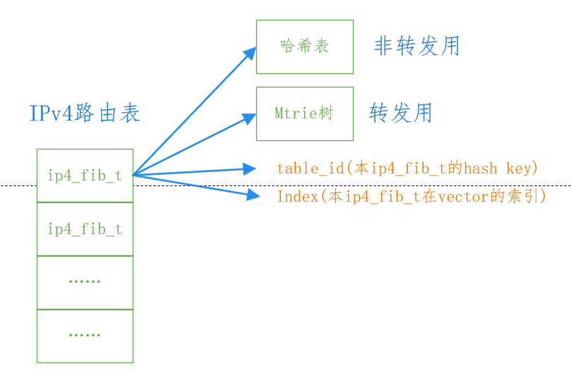

## FIB

### ip4_fib_t

**IPv4路由表**
```
/* The ‘non-forwarding’ ip4_fib_t contains all the entries in the table and, 
 * the ‘forwarding’ contains the entries that are matched against in the data-plane. 
 * The difference between the two sets are the entries that should not be matched in the data-plane. 
 * Each ip4_fib_t comprises an mtrie (for fast lookup in the data-plane) and a hash table per-prefix length (for lookup in the control plane). 
 * 
 * IPv6 also has the concept of forwarding and non-forwarding entries, 
 * however for IPv6 all the forwardind entries are stored in a single hash table (same goes for the non-forwarding). 
 * The key to the hash table includes the IPv6 table-id.
 */
// IPv4路由表包括转发路由（数据平面用于匹配的树）和非转发路由（所有路由）
typedef struct ip4_fib_t_
{
  /** Required for pool_get_aligned */
  CLIB_CACHE_LINE_ALIGN_MARK(cacheline0);

  /**
   * Mtrie for fast lookups. Hash is used to maintain overlapping prefixes.
   * First member so it's in the first cacheline.
   */
  // 注意： the forwarding table is an mtrie.
  ip4_fib_mtrie_t mtrie;

  /* Hash table for each prefix length mapping. */
  // 注意： the non-forwarding table is an array of hash tables indexed by mask length.
  uword *fib_entry_by_dst_address[33];

  /* Table ID (hash key) for this FIB. */
  u32 table_id;

  /* Index into FIB vector. */
  u32 index;
} ip4_fib_t;
```


**协议无关的fib table**
```
/**
 * @brief 
 *   A protocol Independent FIB table
 */
typedef struct fib_table_t_
{
    /**
     * Which protocol this table serves. Used to switch on the union above.
     */
    fib_protocol_t ft_proto;

    /**
     * Table flags
     */
    fib_table_flags_t ft_flags;

    /**
     * per-source number of locks on the table
     */
    u32 *ft_locks;
    u32 ft_total_locks;

    /**
     * Table ID (hash key) for this FIB.
     */
    u32 ft_table_id;

    /**
     * Index into FIB vector.
     */
    fib_node_index_t ft_index;

    /**
     * flow hash configuration
     */
    u32 ft_flow_hash_config;

    /**
     * Per-source route counters
     */
    u32 *ft_src_route_counts;

    /**
     * Total route counters
     */
    u32 ft_total_route_counts;

    /**
     * Epoch - number of resyncs performed
     */
    u32 ft_epoch;

    /**
     * Table description
     */
    u8* ft_desc;
} fib_table_t;
```

### 创建IPv4路由表

```
/**
 * @brief Get or create an IPv4 fib.
 *
 * Get or create an IPv4 fib with the provided table ID.
 *
 * @param table_id
 *      When set to \c ~0, an arbitrary and unused fib ID is picked
 *      and can be retrieved with \c ret->table_id.
 *      Otherwise, the fib ID to be used to retrieve or create the desired fib.
 * @returns A pointer to the retrieved or created fib.
 *
 */
extern u32 ip4_fib_table_find_or_create_and_lock(u32 table_id,
                                                 fib_source_t src);
extern u32 ip4_fib_table_create_and_lock(fib_source_t src);
```

**核心函数**
```
static u32
ip4_create_fib_with_table_id (u32 table_id,
                              fib_source_t src)
{
    // fib table
    fib_table_t *fib_table;
    // ipv4 fib
    ip4_fib_t *v4_fib;
    void *old_heap;

    // 从fib池中申请一个fib table
    pool_get(ip4_main.fibs, fib_table);
    clib_memset(fib_table, 0, sizeof(*fib_table));

    old_heap = clib_mem_set_heap (ip4_main.mtrie_mheap);
    pool_get_aligned(ip4_main.v4_fibs, v4_fib, CLIB_CACHE_LINE_BYTES);
    clib_mem_set_heap (old_heap);

    ASSERT((fib_table - ip4_main.fibs) == (v4_fib - ip4_main.v4_fibs));

    // which protocol this table servers.
    fib_table->ft_proto = FIB_PROTOCOL_IP4;
    // 在fib vector的索引
    fib_table->ft_index = v4_fib->index = (fib_table - ip4_main.fibs);

    // Hash table mapping table id to fib index. ID space is not necessarily dense; index space is dense.
    // key->table_id, value->fib_table->ft_index
    hash_set (ip4_main.fib_index_by_table_id, table_id, fib_table->ft_index);
    // 统一赋table id
    fib_table->ft_table_id = v4_fib->table_id = table_id;
    // 配置流hash计算方法，默认为5元组
    fib_table->ft_flow_hash_config = IP_FLOW_HASH_DEFAULT;
    
    fib_table_lock(fib_table->ft_index, FIB_PROTOCOL_IP4, src);

    // 初始化用于转发的mtrie树
    ip4_mtrie_init(&v4_fib->mtrie);

    /*
     * add the special entries into the new FIB
     */
    int ii;

    // 向fib table中添加一些特殊前缀的路由，0.0.0.0/0，0.0.0.0/32，240.0.0.0/4，224.0.0.0/4，255.255.255.255/32
    for (ii = 0; ii < ARRAY_LEN(ip4_specials); ii++)
    {
      // 前缀
      fib_prefix_t prefix = ip4_specials[ii].ift_prefix;
      
      // 前缀地址赋值
      prefix.fp_addr.ip4.data_u32 = clib_host_to_net_u32(prefix.fp_addr.ip4.data_u32);

      // 路由插入到fib table中
      fib_table_entry_special_add(fib_table->ft_index,
                    &prefix,
                    ip4_specials[ii].ift_source,
                    ip4_specials[ii].ift_flag);
    }

    // 返回table index
    return (fib_table->ft_index);
}
```
