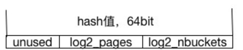
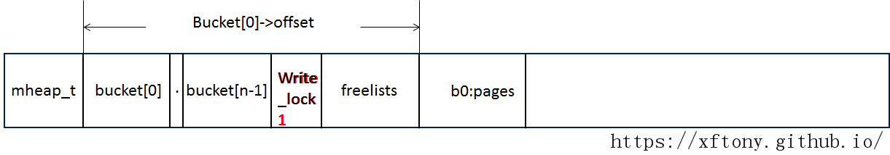
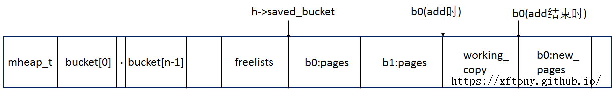

## bihash

### bihash简介

Bihash（Bounded-index extensible hash），其特点可大致概括如下：

> 1.bihash支持8/16/24/40/48等类型，减少对于_mm_crc32_u32/16等的使用，提高效率的同时，避免引入GCC的bug。
> 
> 2.bihash使用64bit Hash值，最多可以支持双层hash查找，第一层bucket查找，第二层page查找（后面具体分析其hash结构）。
> 
> 3.bucket大小和page大小均为2的指数倍，因此hash查找时，仅需要位与操作即可。
> 
> 4.采用working_copy，bucket操作区变换前后添加内存屏障，实现线程安全，使得bihash的查找无锁，修改时仍可进行查找。
> 
> 5.采用freelists减少heap的碎片化，同时提高分配效率。
> 
> 6.采用cache_lru的方式，提高查找效率。

### hash计算

Bihash计算hash值时，对key进行hash。采用clib_crc32c或者clib_xxhash算法进行计算，x86中默认为clib_crc32c。key长度为8的倍数，即为了尽量使用_mm_crc32_u64函数，避免进一步使用_mm_crc32_u32等，出现GCC bug，同时加快了计算效率。得到的hash值为64bit，其结构如下：



后log2_nbuckets位用于表示所落buckets的index，中间log2_pages表示具体page的index，即bucket、page的双层hash。注意，当page级出现hash冲突的时候，该层可能被拉成线形。

### 数据结构

主要介绍三个数据结构，`BVT (clib_bihash_value)`， `BVT (clib_bihash_bucket)`，以及`BVT (clib_bihash)`。其中BVT是个宏，用于将其转换为对应的bihash类型，如_8_8，_16_8，其中第一个数字表示key的长度，第二个数字表示value的长度，单位字节，所以`BVT (clib_bihash_value)`阅读时可直接将其当作`clib_bihash_value_8_8`。

`BVT (clib_bihash_value)` 为存放若干kvp的数据结构，vpp中将其记作page，默认情况每个page中存放`BIHASH_KVP_PER_PAGE`（默认为4）个`kvp`。具体数据结构如下：

```
typedef struct BV (clib_bihash_value)
{ // bucket位置决定是kvp（*buckets）或者next_free（**free_list）
  union
  {
    // 真正存放的kvp
    BVT (clib_bihash_kv) kvp[BIHASH_KVP_PER_PAGE];
    // 当该bucket被free后，通过next_free将释放的内存空间串联起来
    struct BV (clib_bihash_value) * next_free;
  };
} BVT (clib_bihash_value);

//kvp的结构体
typedef struct
{
  u64 key;			/**< the key */
  u64 value;		/**< the value */
} clib_bihash_kv_8_8_t;
```

`BVT (clib_bihash_bucket)`为bucket的数据结构，记录该bucket的详细信息。具体数据结构如下：

```
typedef struct
{
  union
  {
    struct
    { // 距离整个bihash内存头部的偏移值
      u32 offset;
      // bihash内是否是page是否是hash的
      u8 linear_search;
      // 该bucket中page数目（log2后的）
      u8 log2_pages;
      // bucket内kvp的数目，当为0是进行free
      i16 refcnt;
    };
    u64 as_u64;
  };
 // bucket的cache，用于提高查找效率，仅对频繁查找相同内容的才有较好效果==
#if BIHASH_KVP_CACHE_SIZE > 0
  u16 cache_lru;
    BVT (clib_bihash_kv) cache[BIHASH_KVP_CACHE_SIZE];
#endif
} BVT (clib_bihash_bucket);
```

BVT (clib_bihash)是bihash的数据结构，记录整个bihash表的全部信息，其具体数据结构如下：

```
typedef struct
{ // 这个目测是没有用到==， 如错，请指正^^
  BVT (clib_bihash_value) * values;
  // buckets指针
  BVT (clib_bihash_bucket) * buckets;
  // 修改时加锁
  volatile u32 *writer_lock;
  // 拷贝区，当进行修改操作时，相应bucket内数据会拷贝到working_copies中
  BVT (clib_bihash_value) ** working_copies;
  int *working_copy_lengths;
  // 用于记录正在修改的bucket位置
  BVT (clib_bihash_bucket) saved_bucket;
  // buckets的数目
  u32 nbuckets;
  u32 log2_nbuckets;
  u8 *name;
  // cache命中情况记录
  u64 cache_hits;
  u64 cache_misses;
  // 用于释放的内存碎片收集，便于下一次快速分配
  BVT (clib_bihash_value) ** freelists;
  // bihash的heap指针
  void *mheap; //heap地址
  // bihash对应的format函数，用于bihash打印
  format_function_t *fmt_fn;
} BVT (clib_bihash);
```

### 具体实现

接下来我们对bihash的具体实现从init过程，add/del过程，search过程，以及free过程进行进行简单介绍。

#### init过程

在这一过程中，init函数主要做四件事情：

> 1.输出bihash结构体的各个参数；
> 
> 2.创建bihash的heap；
> 
> 3.在heap中创建bucket的vec；
> 
> 4.分配write_lock内存；
> 
> 5.针对每个bucket初始化缓存index序列(如果cache使能了) cache_lru (0 1 2 3 4）

完成初始化后，其在内存中的情况如下图所示：


add/del过程我们以add和del，以及空桶和非空桶进行区别，分为四种情况进行讨论。

```
void BV (clib_bihash_init) (BVT (clib_bihash) * h, char *name, u32 nbuckets, uword memory_size)
{
  void *oldheap;
  int i;
  // 各种参数初始化
  nbuckets = 1 << (max_log2 (nbuckets));

  h->name = (u8 *) name;
  h->nbuckets = nbuckets;
  h->log2_nbuckets = max_log2 (nbuckets);
  h->cache_hits = 0;
  h->cache_misses = 0;
  //  通过mheap_alloc分配内存
  if (h->mheap == NULL) /* Allow customerized mheap, by Jordy*/
    h->mheap = mheap_alloc (0 /* use VM */ , memory_size);
  
  //  对该内存进行初始化，包括初始化bucket指针的vec，lock等
  oldheap = clib_mem_set_heap (h->mheap);
  vec_validate_aligned (h->buckets, nbuckets - 1, CLIB_CACHE_LINE_BYTES);
  h->writer_lock = clib_mem_alloc_aligned (CLIB_CACHE_LINE_BYTES,
					   CLIB_CACHE_LINE_BYTES);
  h->writer_lock[0] = 0;
  //  针对每个bucket初始化cache
  for (i = 0; i < nbuckets; i++)
    BV (clib_bihash_reset_cache) (h->buckets + i);

  clib_mem_set_heap (oldheap);

  h->fmt_fn = NULL;
}
```

#### add/del过程

add/del过程我们以add和del，以及空桶和非空桶进行区别，分为四种情况进行讨论。

**空桶add**

> 1.空桶，即bucket->offset为0;
> 
> 2.为桶分配kvp存储空间(page), 先从h->freelists中查找，发现freelist为空，创建freelists的vec, 即*clib_bihash_value的vec；
> 
> 3.创建pages，即BVT (clib_bihash_value)对象，并将bucket的offset设为该pages到heap->mheap的offset，将kvp放置于该page，并bucket的refcnt+=1。

其内存对应的结构如图所示：



**空桶del**

> 1.空桶，即bucket->offset为0
> 
> 2.return -1即可

**非空桶add**

> 1.找到对应的bucket,(b0)，将b0在h->working_copy[threads_index]中复制一份; 
> 
> 2、将b0 (即,bucket[0]->offset)设在working_copy，即图中b0(add时)，查找时，查找的是working_copy区，增加操作在h->saved_bucke区进行处理，保证线程安全。

a.不需要扩展的情况，即增加新kvp不会造成冲突：

> 1.完成增加后，b0重新指向h->saved_bucket

b.需要扩展的情况：
扩展， pages×2, 内存从freelist中取，此时操作的区域是working_copy区(仅作为被复制的对应，不会影响查询)。
扩展分为两种，hash扩展和线性扩展

> 1.1.hash扩展，原来的kvp，重新hash，落到new_bucket中，若hash的page发生碰撞，则hash扩展失败，释放new_pages，即将其挂在freelist中，进行b；
> 
> 1.2.线性扩展，原来的kvp按序落到new_bucket中， 标记new_pages-> linear_search=1；
> 
> 2.扩展完成后，b0的offset为new_pages; 将kvp放置于new_pages，并bucket的refcnt+=1；
> 
> 3.释放h->saved_bucket， 即原来的pages，将该块存储空间的地址放入freelist[log2_pages]的表头。

扩展情况下，其非空桶add过程，内存对应的结构如下图所示：



**非空桶del**

> 1.找到对应的bucket,(b0)，将b0在h->working_copy[threads_index]中复制一份，将b0 (即,bucket[0]->offset)设在working_copy处，即查找时，查找的是working_copy区，删除操作在h->saved_bucke区进行处理；
> 
> 2.查找key，hash或者linear查找，找到key，删除之（置为全1）；
> 
> 3.h->saved_bucket.refcnt>1, 则自减1，b0.as_u64 = h->saved_bucket.as_u64 否则free该pages，将其放到freelists中。

```
int BV (clib_bihash_add_del) (BVT (clib_bihash) * h, BVT (clib_bihash_kv) * add_v, int is_add)
{
  u32 bucket_index;
  BVT (clib_bihash_bucket) * b, tmp_b;
  BVT (clib_bihash_value) * v, *new_v, *save_new_v, *working_copy;
  int rv = 0;
  int i, limit;
  u64 hash, new_hash;
  u32 new_log2_pages, old_log2_pages;
  u32 thread_index = os_get_thread_index ();
  int mark_bucket_linear;
  int resplit_once;
  
  // 计算kvp的hash值
  hash = BV (clib_bihash_hash) (add_v);
  // 桶定位
  bucket_index = hash & (h->nbuckets - 1);
  b = &h->buckets[bucket_index];
  
  hash >>= h->log2_nbuckets;

  tmp_b.linear_search = 0;
  // 上锁
  while (__sync_lock_test_and_set (h->writer_lock, 1))
  ;

  /* First elt in the bucket? */
  // 空桶情况
  if (b->offset == 0)
  {
    if (is_add == 0)
	{
	  rv = -1;
	  goto unlock;
	}

    v = BV (value_alloc) (h, 0);

    *v->kvp = *add_v;
    tmp_b.as_u64 = 0;
    tmp_b.offset = BV (clib_bihash_get_offset) (h, v);
    tmp_b.refcnt = 1;

    b->as_u64 = tmp_b.as_u64;
    goto unlock;
  }

  /* Note: this leaves the cache disabled */
  /* 为保证线程安全，进行bucket的备份，复制到working_copy中， 
   * 将原bucket的指针指向这个working_copy中，
   * h->saved_bucket指向原bucket的内存位置
   * PS: working_copy中的per_thread没看出什么用，求解惑
   */
  BV (make_working_copy) (h, b);
  // 找到bucket具体对应的pages  
  v = BV (clib_bihash_get_value) (h, h->saved_bucket.offset);
  // 确定循环范围， hash则从指定page内直接找， linear则全桶找
  limit = BIHASH_KVP_PER_PAGE;
  v += (b->linear_search == 0) ? hash & ((1 << b->log2_pages) - 1) : 0;
  if (b->linear_search)
    limit <<= b->log2_pages;

  if (is_add)
  {
      /*
       * For obvious (in hindsight) reasons, see if we're supposed to
       * replace an existing key, then look for an empty slot.
       */

      for (i = 0; i < limit; i++)
	{ // key相同，更新原value值，结束
	  if (!memcmp (&(v->kvp[i]), &add_v->key, sizeof (add_v->key)))
	    {
	      clib_memcpy (&(v->kvp[i]), add_v, sizeof (*add_v));
	      CLIB_MEMORY_BARRIER ();
	      /* Restore the previous (k,v) pairs */
	      b->as_u64 = h->saved_bucket.as_u64;
	      goto unlock;
	    }
	}
      for (i = 0; i < limit; i++)
	{ // 找到第一个空solt（bihash中全1为空）
	  if (BV (clib_bihash_is_free) (&(v->kvp[i])))
	    {
	      clib_memcpy (&(v->kvp[i]), add_v, sizeof (*add_v));
	      CLIB_MEMORY_BARRIER ();
	      b->as_u64 = h->saved_bucket.as_u64;
	      b->refcnt++;
	      goto unlock;
	    }
	}
      /* no room at the inn... split case... */
     // 没有空solt，则需要进行扩展 
  }
  else
  //非空桶 del 情况
  {
    for (i = 0; i < limit; i++)
	{ // 找key，然后删除之
	  if (!memcmp (&(v->kvp[i]), &add_v->key, sizeof (add_v->key)))
	  {
	    memset (&(v->kvp[i]), 0xff, sizeof (*(add_v)));
	    CLIB_MEMORY_BARRIER ();
	    if (PREDICT_TRUE (h->saved_bucket.refcnt > 1))
		{
		  h->saved_bucket.refcnt -= 1;
		  b->as_u64 = h->saved_bucket.as_u64;
		  goto unlock;
		}
	    else
		{ // bucket已经空了，将其释放，即放入freelist中
		  tmp_b.as_u64 = 0;
		  goto free_old_bucket;
		}
	  }
	} 
    // 没找到==
    rv = -3;
    b->as_u64 = h->saved_bucket.as_u64;
    goto unlock;
  }
  // 开始进行扩展
  old_log2_pages = h->saved_bucket.log2_pages;
  new_log2_pages = old_log2_pages + 1;
  mark_bucket_linear = 0;

  working_copy = h->working_copies[thread_index];
  resplit_once = 0;
  // 首先尝试哈希扩展，失败则进行线性扩展
  new_v = BV (split_and_rehash) (h, working_copy, old_log2_pages,
				 new_log2_pages);
  if (new_v == 0)
  {
    try_resplit:
      resplit_once = 1;
      new_log2_pages++;
      /* Try re-splitting. If that fails, fall back to linear search */
      new_v = BV (split_and_rehash) (h, working_copy, old_log2_pages,
				     new_log2_pages);
      if (new_v == 0)
	  {
	    mark_linear:
	      new_log2_pages--;
	      /* pinned collisions, use linear search */
	      new_v =
	        BV (split_and_rehash_linear) (h, working_copy, old_log2_pages,
					  new_log2_pages);
	    mark_bucket_linear = 1;
	  }
  }

  /* Try to add the new entry */
  save_new_v = new_v;
  new_hash = BV (clib_bihash_hash) (add_v);
  limit = BIHASH_KVP_PER_PAGE;
  if (mark_bucket_linear)
    limit <<= new_log2_pages;
  new_hash >>= h->log2_nbuckets;
  new_hash &= (1 << new_log2_pages) - 1;
  new_v += mark_bucket_linear ? 0 : new_hash;

  for (i = 0; i < limit; i++)
  {
    if (BV (clib_bihash_is_free) (&(new_v->kvp[i])))
	{
	  clib_memcpy (&(new_v->kvp[i]), add_v, sizeof (*add_v));
	  goto expand_ok;
	}
  }

  /* Crap. Try again */
  BV (value_free) (h, save_new_v, new_log2_pages);
  /*
   * If we've already doubled the size of the bucket once,
   * fall back to linear search now.
   */
  if (resplit_once)
    goto mark_linear;
  else
    goto try_resplit;

expand_ok:
  tmp_b.log2_pages = new_log2_pages;
  tmp_b.offset = BV (clib_bihash_get_offset) (h, save_new_v);
  tmp_b.linear_search = mark_bucket_linear;
  tmp_b.refcnt = h->saved_bucket.refcnt + 1;

free_old_bucket:

  CLIB_MEMORY_BARRIER ();
  b->as_u64 = tmp_b.as_u64;
  v = BV (clib_bihash_get_value) (h, h->saved_bucket.offset);

  BV (value_free) (h, v, h->saved_bucket.log2_pages);

unlock:
  BV (clib_bihash_reset_cache) (b);
  BV (clib_bihash_unlock_bucket) (b);
  CLIB_MEMORY_BARRIER ();
  h->writer_lock[0] = 0;
  return rv;
}
```

#### search过程

> 1.对key进行hash；
> 
> 2.根据hash值找到对应的bucket，若支持cache，则在bucket[k]->cache中查找，找到return 0；
> 
> 3.在b0:new_pages 中查找，根据bucket[0]-> linear_search，进行hash或者线型查找，找到，则更新bucket[0]->cache，循环bucket[0]->cache_lru，否则return -1。

```
int BV (clib_bihash_search) (BVT (clib_bihash) * h, BVT (clib_bihash_kv) * search_key, BVT (clib_bihash_kv) * valuep)
{
  u64 hash;
  u32 bucket_index;
  BVT (clib_bihash_value) * v;
#if BIHASH_KVP_CACHE_SIZE > 0
  BVT (clib_bihash_kv) * kvp;
#endif
  BVT (clib_bihash_bucket) * b;
  int i, limit;

  ASSERT (valuep);
  // 计算hash值
  hash = BV (clib_bihash_hash) (search_key);
  // 定位bucket
  bucket_index = hash & (h->nbuckets - 1);
  b = &h->buckets[bucket_index];

  if (b->offset == 0)
    return -1;
// 若cache enable了 则先从cache中进行查找
#if BIHASH_KVP_CACHE_SIZE > 0
  /* Check the cache, if currently enabled */
  if (PREDICT_TRUE ((b->cache_lru & (1 << 15)) == 0))
    {
      limit = BIHASH_KVP_CACHE_SIZE;
      kvp = b->cache;
      for (i = 0; i < limit; i++)
	{
	  if (BV (clib_bihash_key_compare) (kvp[i].key, search_key->key))
	    {
	      *valuep = kvp[i];
	      h->cache_hits++;
	      return 0;
	    }
	}
    }
#endif

  hash >>= h->log2_nbuckets;
  // 找到bucket具体对应的pages
  v = BV (clib_bihash_get_value) (h, b->offset);
  // 确定查找范围
  limit = BIHASH_KVP_PER_PAGE;
  // hash从指定page开始查找，否则从头开始找
  v += (b->linear_search == 0) ? hash & ((1 << b->log2_pages) - 1) : 0;
  if (PREDICT_FALSE (b->linear_search))
    limit <<= b->log2_pages;
  // 循环查找
  for (i = 0; i < limit; i++)
    {
      if (BV (clib_bihash_key_compare) (v->kvp[i].key, search_key->key))
	{
	  *valuep = v->kvp[i];
	  // 更新cache
#if BIHASH_KVP_CACHE_SIZE > 0
	  u8 cache_slot;
	  /* Shut off the cache */
	  if (BV (clib_bihash_lock_bucket) (b))
	    {
	      cache_slot = BV (clib_bihash_get_lru) (b);
	      b->cache[cache_slot] = v->kvp[i];
	      BV (clib_bihash_update_lru) (b, cache_slot);

	      /* Reenable the cache */
	      BV (clib_bihash_unlock_bucket) (b);
	      h->cache_misses++;
	    }
#endif
	  return 0;
	}
    }
  return -1;
}
```

#### free过程

> 1.释放mheap，munmap(h->mheap)
> 
> 2.清空结构体，memset (h, 0, sizeof (*h))

```
void BV (clib_bihash_free) (BVT (clib_bihash) * h)
{ 
  // 释放内存
  mheap_free (h->mheap);
  // 清空bihash结构体
  memset (h, 0, sizeof (*h));
}
```

### 接口

```
/** Get pointer to value page given its clib mheap offset */
static inline void *clib_bihash_get_value (clib_bihash * h, uword offset);

/** Get clib mheap offset given a pointer */
static inline uword clib_bihash_get_offset (clib_bihash * h, void *v);

/** initialize a bounded index extensible hash table

    @param h - the bi-hash table to initialize
    @param name - name of the hash table
    @param nbuckets - the number of buckets, will be rounded up to
a power of two
    @param memory_size - clib mheap size, in bytes
*/

void clib_bihash_init
  (clib_bihash * h, char *name, u32 nbuckets, uword memory_size);

/** Destroy a bounded index extensible hash table
    @param h - the bi-hash table to free
*/

void clib_bihash_free (clib_bihash * h);

/** Add or delete a (key,value) pair from a bi-hash table

    @param h - the bi-hash table to search
    @param add_v - the (key,value) pair to add
    @param is_add - add=1, delete=0
    @returns 0 on success, < 0 on error
    @note This function will replace an existing (key,value) pair if the
    new key matches an existing key
*/
int clib_bihash_add_del (clib_bihash * h, clib_bihash_kv * add_v, int is_add);


/** Search a bi-hash table, use supplied hash code

    @param h - the bi-hash table to search
    @param hash - the hash code
    @param in_out_kv - (key,value) pair containing the search key
    @returns 0 on success (with in_out_kv set), < 0 on error
*/
int clib_bihash_search_inline_with_hash
  (clib_bihash * h, u64 hash, clib_bihash_kv * in_out_kv);

/** Search a bi-hash table

    @param h - the bi-hash table to search
    @param in_out_kv - (key,value) pair containing the search key
    @returns 0 on success (with in_out_kv set), < 0 on error
*/
int clib_bihash_search_inline (clib_bihash * h, clib_bihash_kv * in_out_kv);

/** Prefetch a bi-hash bucket given a hash code

    @param h - the bi-hash table to search
    @param hash - the hash code
    @note see also clib_bihash_hash to compute the code
*/
void clib_bihash_prefetch_bucket (clib_bihash * h, u64 hash);

/** Prefetch bi-hash (key,value) data given a hash code

    @param h - the bi-hash table to search
    @param hash - the hash code
    @note assumes that the bucket has been prefetched, see
     clib_bihash_prefetch_bucket
*/
void clib_bihash_prefetch_data (clib_bihash * h, u64 hash);

/** Search a bi-hash table

    @param h - the bi-hash table to search
    @param search_key - (key,value) pair containing the search key
    @param valuep - (key,value) set to search result
    @returns 0 on success (with valuep set), < 0 on error
    @note used in situations where key modification is not desired
*/
int clib_bihash_search_inline_2
  (clib_bihash * h, clib_bihash_kv * search_key, clib_bihash_kv * valuep);

/* Calback function for walking a bihash table
 *
 * @param kv - KV pair visited
 * @param ctx - Context passed to the walk
 * @return BIHASH_WALK_CONTINUE to continue BIHASH_WALK_STOP to stop
 */
typedef int (*clib_bihash_foreach_key_value_pair_cb) (clib_bihash_kv * kv,
						      void *ctx);

/** Visit active (key,value) pairs in a bi-hash table

    @param h - the bi-hash table to search
    @param callback - function to call with each active (key,value) pair
    @param arg - arbitrary second argument passed to the callback function
    First argument is the (key,value) pair to visit
*/
void clib_bihash_foreach_key_value_pair (clib_bihash * h,
					 clib_bihash_foreach_key_value_pair_cb
					 * callback, void *arg);
```