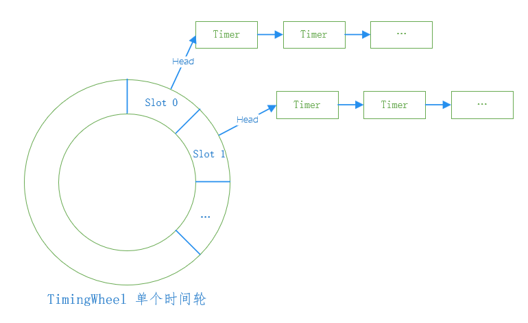

## 时间轮定时器(TimingWheel Timer)

TW定时器模板文件`vppinfra/tw_timer_template.h`定义了定时器的基本参数，具体实例由`vppinfra/tw_timer_*s_*w_*sl.h/c`等文件实现。

### TW定时器原理



### TW定时器API

```
初始化定时器：
tw_timer_2t_1w_2048sl(&tm->single_wheel/* timer wheel pointer */, 
					  expired_timer_single_callback/*expired callback*/, 
					  1.0/* timer interval */);
启动定时器：
handle = tw_timer_start_2t_1w_2048sl(&tm->single_wheel/* timer wheel pointer */,
									 elt_index/**/,
									 [0 | 1]/* timer id */,
									 expiration_time_in_u32_ticks/**/);
停止定时器：
tw_timer_stop_2t_1w_2048sl(&tm->single_wheel/* timer wheel pointer */,
						   handle/**/);
定时器过期回调：
static void expired_timer_single_callback (u32 * expired_timers)
{
    int i;
    u32 pool_index, timer_id;
    tw_timer_test_elt_t *e;
    tw_timer_test_main_t *tm = &tw_timer_test_main;

    /* 遍历过期定时器 */
    for (i = 0; i < vec_len (expired_timers);
    {
        pool_index = expired_timers[i] & 0x7FFFFFFF;
        timer_id = expired_timers[i] >> 31;

        ASSERT (timer_id == 1);

        e = pool_elt_at_index (tm->test_elts, pool_index);

        if (e->expected_to_expire != tm->single_wheel.current_tick)
        {
            fformat (stdout, "[%d] expired at %d not %d\n", e - tm->test_elts, tm->single_wheel.current_tick, e->expected_to_expire);
        }
        pool_put (tm->test_elts, e);
    }
}
```
### TW定时器结构体

**定时器结构体**
```
typedef struct
{
  /** 下一个定时器  */
  u32 next;
  /** 前一个定时器  */
  u32 prev;

  union
  {
    struct
    {
#if (TW_TIMER_WHEELS == 3)
      /** fast ring offset, only valid in the slow ring */
      u16 fast_ring_offset;
      /** slow ring offset, only valid in the glacier ring */
      u16 slow_ring_offset;
#endif
#if (TW_TIMER_WHEELS == 2)
      /** fast ring offset, only valid in the slow ring */
      u16 fast_ring_offset;
      /** slow ring offset, only valid in the glacier ring */
      u16 pad;
#endif
    };

#if (TW_OVERFLOW_VECTOR > 0)
    u64 expiration_time;
#endif
  };

  /** 用户定时器句柄 */
  u32 user_handle;
} TWT (tw_timer);

typedef enum
{
  /** Fast timer ring ID */
  TW_TIMER_RING_FAST,
  /** Slow timer ring ID */
  TW_TIMER_RING_SLOW,
  /** Glacier ring ID */
  TW_TIMER_RING_GLACIER,
} tw_ring_index_t;
```

**插槽结构体**
```
typedef struct
{
  /** Listhead of timers which expire in this interval */
  // 在此时间间隔内到期的定时器列表
  u32 head_index;
} tw_timer_wheel_slot_t;
```

**时间轮结构体**
```
typedef struct
{
  /** 定时器池 */
  TWT (tw_timer) * timers;

  /** 下次应该运行的时间轮 */
  f64 next_run_time;

  /** 上次运行的时间轮 */
  f64 last_run_time;

  /** 一秒滴答次数 */
  f64 ticks_per_second;

  /** 定时器间隔 */
  f64 timer_interval;

  /** 当前滴答数 */
  u64 current_tick;

  /** 第一个过期时间滴答数 */
  u64 first_expires_tick;

  /** 当前时间轮索引，只能是1,2,3 */
  u32 current_index[TW_TIMER_WHEELS];

  /** 时间轮插槽数组 */
  tw_timer_wheel_slot_t w[TW_TIMER_WHEELS][TW_SLOTS_PER_RING];

#if TW_OVERFLOW_VECTOR > 0
  tw_timer_wheel_slot_t overflow;
#endif

#if TW_FAST_WHEEL_BITMAP > 0
  /** Fast wheel slot occupancy bitmap */
  uword *fast_slot_bitmap;
#endif

  /** 已过期定时器回调函数, 接收多个(vector)定时器句柄 */
  void (*expired_timer_callback) (u32 * expired_timer_handles);
  /** 已过期定时器vector */
  u32 *expired_timer_handles;
  /** 可用于存储已过期定时器vector的最大值 */
  u32 max_expirations;

  /** current trace index */
#if TW_START_STOP_TRACE_SIZE > 0
  /* Start/stop/expire tracing */
  u32 trace_index;
  u32 trace_wrapped;
    TWT (trace) traces[TW_START_STOP_TRACE_SIZE];
#endif


} TWT (tw_timer_wheel);
```

### 初始化定时器

#### vppinfra/tw_timer_template.c

**初始化定时器**
```
/**
 * @brief Initialize a tw timer wheel template instance
 * @param tw_timer_wheel_t * tw timer wheel object pointer
 * @param void * expired_timer_callback. Passed a u32 * vector of
 *   expired timer handles. The callback is optional.
 * @param f64 timer_interval_in_seconds
 */
void
TW (tw_timer_wheel_init) (TWT (tw_timer_wheel) * tw,
			  void *expired_timer_callback,
			  f64 timer_interval_in_seconds, u32 max_expirations)
{
  int ring, slot;
  tw_timer_wheel_slot_t *ts;
  TWT (tw_timer) * t;
  clib_memset (tw, 0, sizeof (*tw));
  
  // 初始化已过期定时器回调函数，和最大个数
  tw->expired_timer_callback = expired_timer_callback;
  tw->max_expirations = max_expirations;
  
  // 时间间隔，合法性检查
  if (timer_interval_in_seconds == 0.0)
  {
      clib_warning ("timer interval is zero");
      abort ();
  }
  // 时间间隔，单位秒
  tw->timer_interval = timer_interval_in_seconds;
  // 每秒滴答数，为时间间隔的倒数
  tw->ticks_per_second = 1.0 / timer_interval_in_seconds;
  // 初始化第一个过期时间滴答数
  tw->first_expires_tick = ~0ULL;
 
  // 检查已过期定时器是否为空，长度是否为0
  vec_validate (tw->expired_timer_handles, 0);
  _vec_len (tw->expired_timer_handles) = 0;

  // 遍历所有时间轮
  for (ring = 0; ring < TW_TIMER_WHEELS; ring++)
  {
      // 遍历每个时间轮上的插槽
      for (slot = 0; slot < TW_SLOTS_PER_RING; slot++)
	  {
	      // 获取插槽
	      ts = &tw->w[ring][slot];
	      // 从定时器池中分配定时器t
	      pool_get (tw->timers, t);
	      // 初始化定时器t
	      clib_memset (t, 0xff, sizeof (*t));
	      // 根据t在定时器池中的索引初始化next和prev
	      t->next = t->prev = t - tw->timers;
	      // 初始插槽时间间隔内到期的定时器列表为t的索引
	      ts->head_index = t - tw->timers;
	  }
  }

#if TW_OVERFLOW_VECTOR > 0
  ts = &tw->overflow;
  pool_get (tw->timers, t);
  clib_memset (t, 0xff, sizeof (*t));
  t->next = t->prev = t - tw->timers;
  ts->head_index = t - tw->timers;
#endif
}
```

**释放定时器**
```
/**
 * @brief Free a tw timer wheel template instance
 * @param tw_timer_wheel_t * tw timer wheel object pointer
 */
void TW (tw_timer_wheel_free) (TWT (tw_timer_wheel) * tw)
{
  int i, j;
  tw_timer_wheel_slot_t *ts;
  TWT (tw_timer) * head, *t;
  u32 next_index;

  // 遍历所有时间轮
  for (i = 0; i < TW_TIMER_WHEELS; i++)
  {
      // 遍历每个时间轮上的插槽
      for (j = 0; j < TW_SLOTS_PER_RING; j++)
	  {
	      // 获取插槽
	      ts = &tw->w[i][j];
		  // 插槽时间间隔内到期的定时器列表头指针
	      head = pool_elt_at_index (tw->timers, ts->head_index);
		  // 回收头指针后面的所有定时器(放回定时器池中)
	      next_index = head->next;
	      while (next_index != ts->head_index)
	      {
		      // 根据索引获取定时器
	          t = pool_elt_at_index (tw->timers, next_index);
			  // next后移
	          next_index = t->next;
			  // 回收定时器到定时器池中
	          pool_put (tw->timers, t);
	      }
		  // 回收头指针定时器
	      pool_put (tw->timers, head);
	  }
  }

#if TW_OVERFLOW_VECVOR > 0
  ts = &tw->overflow;
  head = pool_elt_at_index (tw->timers, ts->head_index);
  next_index = head->next;

  while (next_index != ts->head_index)
  {
      t = pool_elt_at_index (tw->timers, next_index);
      next_index = t->next;
      pool_put (tw->timers, t);
  }
  pool_put (tw->timers, head);
#endif

  // 复位时间轮定时器内存，清空
  clib_memset (tw, 0, sizeof (*tw));
}
```

**启动定时器**
```
/**
 * @brief Start a Tw Timer
 * @param tw_timer_wheel_t * tw timer wheel object pointer
 * @param u32 user_id user defined timer id, presumably for a tw session
 * @param u32 timer_id app-specific timer ID. 4 bits.
 * @param u64 interval timer interval in ticks
 * @returns handle needed to cancel the timer
 */
u32
TW (tw_timer_start) (TWT (tw_timer_wheel) * tw, u32 user_id, u32 timer_id,
		     u64 interval)
{
  TWT (tw_timer) * t;

  ASSERT (interval);

  // 从定时器池中分配定时器t
  pool_get (tw->timers, t);
  // 初始化定时器t
  clib_memset (t, 0xff, sizeof (*t));

  // 计算用户定时器句柄
  t->user_handle = TW (make_internal_timer_handle) (user_id, timer_id);

  // 将定时器t和时间间隔加入到时间轮定时器中
  timer_add (tw, t, interval);
  // 返回新加入的定时器t索引
  return t - tw->timers;
}
```

```
static inline u32
TW (make_internal_timer_handle) (u32 pool_index, u32 timer_id)
{
  u32 handle;

  // 检验timer_id(timers per object)
  ASSERT (timer_id < TW_TIMERS_PER_OBJECT);
#if LOG2_TW_TIMERS_PER_OBJECT > 0
  // 校验pool_id(user_id)
  ASSERT (pool_index < (1 << (32 - LOG2_TW_TIMERS_PER_OBJECT)));

  // 计算handle(user handle)
  handle = (timer_id << (32 - LOG2_TW_TIMERS_PER_OBJECT)) | (pool_index);
#else
  // handle赋pool_index(user_id)
  handle = pool_index;
#endif
  return handle;
}
```

**停止定时器**
```
/**
 * @brief Stop a tw timer
 * @param tw_timer_wheel_t * tw timer wheel object pointer
 * @param u32 handle timer cancellation returned by tw_timer_start
 */
void TW (tw_timer_stop) (TWT (tw_timer_wheel) * tw, u32 handle)
{
  TWT (tw_timer) * t;

#if TW_TIMER_ALLOW_DUPLICATE_STOP
  /*
   * A vlib process may have its timer expire, and receive
   * an event before the expiration is processed.
   * That results in a duplicate tw_timer_stop.
   */
  if (pool_is_free_index (tw->timers, handle))
    return;
#endif
#if TW_START_STOP_TRACE_SIZE > 0
  TW (tw_timer_trace) (tw, ~0, ~0, handle);
#endif

  // 根据定时器索引，找到定时器t
  t = pool_elt_at_index (tw->timers, handle);

  /* in case of idiotic handle (e.g. passing a listhead index) */
  ASSERT (t->user_handle != ~0);

  // 从定时器池中移除定时器t
  timer_remove (tw->timers, t);

  // 释放定时器t
  pool_put_index (tw->timers, handle);
}
```